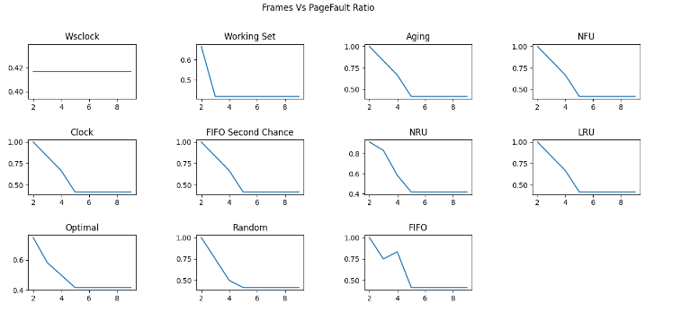
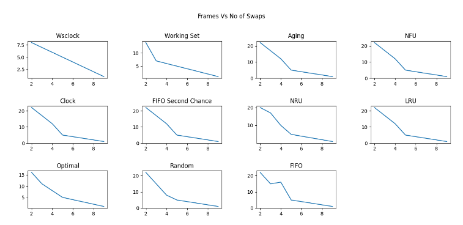

# PAGE REPLACEMENT POLICIES SIMULATION

This Project is a memory management simulator that uses paging and measures the
performances of page replacement algorithms such as -

- FIFO (first in first out)
- LRU (least recently used)
- NFU (not frequently used)
- OPT (optimal page replacement)
- Random
- NRU (Not Recently Used)
- FIFO with second chance
- Clock
- Working Set
- Aging
- WSClock

Keeping track of what pages are being loaded, we observed the performance of all these
page replacement algorithms under different situations( number of frames allocated to
process in main memory) and represented in the form of graphs

### PROBLEM DESCRIPTION
To evaluate the performance of above-mentioned algorithms using the parameters like
number of frames and length of page streams. To analyse the miss ratio, the number of
swaps, and Page faults for each algorithm.

### SOLUTION APPROACH
For each page replacement policy, we have written an algorithm to mimic that policy and
implemented it using C++.  
We have used a Python program to represent the result of the analysis of each page
replacement policy in the form of graphs. In those graphs, we have shown the behavior
of each policy under different situations (number of frames allocated to process in main
memory).  
Finally, we have used a bash script to make all the c++ and python programs run, using a
single command. Later in the report, we have attached an example that shows how our
project is working.  

### WORK DISTRIBUTION
- Aman Izardar - WSClock , Working set , Aging
- Ayush Mittal - Clock ,FIFO with second chance , Not Recently Used
- Annapoorani A. - First in First Out , Not Frequently Used
- Diksha Daryani - Least Recently used , Optimal , Random

### PROBLEMS FACED AND SHORTCOMINGS
One of the main problems was different elaboration of some page replacements policies
on different websites. We have followed the standard resources in that case.  
Making assumptions such as considering no. of clock cycles as page stream index. For
Example, if it is 0th-page that is asking for a frame then we assumed that this page is
asking for the frame at 0th cycle of cpu.  
Working set Works on Sliding Window. So the main problem was to implement a
dynamic frame allocator with a sliding window protocol. To represent a window we’ve
used a timer of T CPU clocks. So if a page is referred in the last T cpu clocks then it will be
in our Working set window, otherwise, it will be out of the window. So no. of frames
allocated to a process in Working set algo will be dynamic.  
Wsclock Works almost the same as Working-set algo with some modification so we’ve
faced same problem that we faced in Working set and resolved the problem similarly.
With FIFO, the major problem faced is Belady's Anomaly. The number of page faults
increases sometimes when the number of frames increases. This should ideally not be
the case, however, FIFO suffers from this drawback. This is because it does not follow a
stack based page replacement policy.
NFU page replacement has the problem that if some page is used repeatedly in the
beginning, it's count increases. However, it may not be used in the future for a very long
time and occupies space in memory. Also, pages that arrive newly are more likely to get
replaced because of low frequency count. Thus it contributes to increased page faults.
NRU, is a hardware-based algorithm, making suitable assumptions and implementing
that part was also tricky. Clock and FIFO with a second chance are very similar policies,
but have differences in implementation, exactly knowing the difference took a lot of
effort.

### RESULTS AND CONCLUSIONS
Coding and analysing these algorithms allowed us to know how the operating system
plays its role in memory management practically and it also helped us to understand and
find the difference between the different algorithms and their behavior in different
scenarios by plotting the graphs for the same.  
It helped us to understand the concept of how VIRTUAL MEMORY can address more
memory than the amount physically installed on the system. The visible advantage with
virtual memory is that programs can be larger than physical memory as it allows us to
extend the use of physical memory by using disk.  

Taking page reference string and producing the result for different numbers of
frames allocated to process in main memory. Using those results, graphs are made.
These graphs show how different policies work/perform under different situations i.e.,
how no. of frames impact the performance of these policies.  
This is one Example of how our simulator is Working. It is taking no. of Frames followed
by page stream also dirty page info bits as the input and generating the following Graph.  
This is how various algo behaves on different no. of Frames:

### Frames Vs Miss Ratio 
 
 
### Frames vs No. of Swaps
 
 
### ASSUMPTION
- No. of Swaps = No. of Swap in + No. of Swap out  
- No. of Swap in = No. of page faults  
- No. of Swap out = No. of page faults - No. of frames  
- In NRU, we’re considering that reference bits are getting reset after every 5-page
references.  
- In NFU(or LFU), the pages having the same frequency count are getting swapped out
based on FIFO policy.  

### Input format 

    A single line, the first integer is no. Of frames, followed by space-separated page
    stream followed by a comma and dirty page stream.
    For example :-
    4 1 3 2 1 , 0 1 0 0
 
 ### CONCLUSION
- The optimal algorithm replaces the page referenced last among the current pages.
Unfortunately, there is no way to determine which page will be last, so in practice, this
algorithm cannot be used. It is useful as a benchmark against which other algorithms
can be measured, however.  
- The NRU algorithm divides pages into four classes depending on the state of the R and M
bits. A random page from the lowest numbered class is chosen. This algorithm is easy to
implement, but it is very crude. Better ones exist.
- FIFO keeps track of the order pages were loaded into memory by keeping them in a
linked list. Removing the oldest page then becomes trivial, but that page might still be in
use, so FIFO is a bad choice.  
- Second chance is a modification to FIFO that checks if a page is in use before removing it.
If it is, the page is spared. This modification greatly improves the performance. Clock is
simply a different implementation of second chance. It has the same performance
properties but takes a little less time to execute the algorithm.  
- LRU is an excellent algorithm, but it cannot be implemented without special hardware. If
this hardware is not available, it cannot be used. NFU is a crude attempt to approximate
LRU. It is not very good. However, aging is a much better approximation to LRU and can
be implemented efficiently. It is a good choice.  
- The last two algorithms use the working set. The working set algorithm is reasonable
performance, but it is somewhat expensive to implement. WSClock is a variant that not
only gives good performance but is also efficient to implement.  
- All in all, the two best algorithms are Working Set and WSClock. They are based on LRU
and the working set, respectively. Both give good paging performance and can be
implemented efficiently. A few other algorithms exist, but these two are probably the
most important in practice.  
